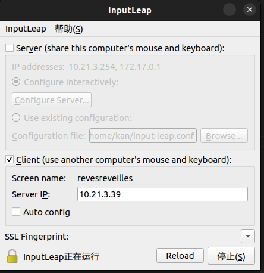

## Ubuntu-Windows 键鼠共享
项目地址:https://github.com/input-leap/input-leap

## 使用教程
以windows作为服务端,Ubuntu为客户端为例:
```bash
Windows10
Ubuntu22.04
```
### Ubuntu
进入项目<font color=green>Releases</font>,下载对应系统安装包
```bash
sudo chmod +777 InputLeap_3.0.2_ubuntu_22-04_amd64.deb 
sudo dpkg -i ./InputLeap_3.0.2_ubuntu_22-04_amd64.deb
```
安装后在终端输入:
```bash
input-leap
```
若无法打开:
```bash
sudo apt install qt6-qpa-plugins
```

勾选**Client**,此时**Server IP**填写Windows的ip
>[!CAUTION]
>注意Screen name和服务端的要对应
### Windows
同理在安装好**Input-leap**后,勾选**server**,点击Configure Server...
按提示添加新屏幕,双击修改屏幕名为对应客户端的名字
点击开始即可